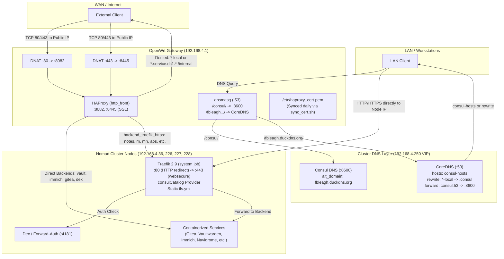

# Traefik & HAProxy Ingress Routing Architecture Review

This document provides a comprehensive investigation and mapping of reverse proxy routing rules across the NixOS / Nomad cluster and OpenWrt edge gateway. All findings are verified against primary source files and live router configuration.

---

## 1. Executive Summary

Traffic routing across the homelab cluster relies on a multi-tiered ingress architecture:
1. **Edge Firewall & Proxy Layer (OpenWrt `192.168.4.1`)**: DNAT forwards external WAN ports 80/443 to HAProxy listening on `:8082` and `:8445` (SSL). HAProxy acts as an external access control filter and performs selective routing—either directing requests straight to application backends via dynamic Consul SRV templates or offloading them to Traefik over HTTPS (`backend_traefik_https`).
2. **Cluster Ingress & Internal Routing Layer (Traefik 2.9 on Nomad `192.168.4.x`)**: Runs as a Nomad system job binding host ports `:80` (redirecting to HTTPS) and `:443`. It dynamically discovers services registered in the HashiCorp Consul Catalog, automatically applying wildcard SSL certificates retrieved from Consul KV.
3. **Internal Resolution & Rewrite Layer (CoreDNS + Consul DNS)**: CoreDNS on cluster nodes rewrites single-level `-local` subdomains to internal `.service.dc1.consul` queries, resolves them through Consul DNS (`:8600`), and rewrites DNS answer records so clients seamlessly connect directly to cluster nodes.

### Key Investigation Findings
- **Critical Security Finding (Dex Auth Bypass)**: Routers in Nomad jobs using `ClientIP(192.168.0.0/16)` to bypass Dex authentication (e.g., `silverbullet` and `storage-analyzer`) inadvertently bypass authentication for **all external WAN users routed through HAProxy**. Because HAProxy connects to Traefik from `192.168.4.1` without PROXY protocol, and Traefik lacks `forwardedHeaders.trustedIPs`, Traefik treats HAProxy as an internal client.
- **Perimeter ACL Gap**: In `haproxy.cfg`, `is_service_domain` denies access from non-internal IPs for `*.service.dc1.fbleagh.duckdns.org` (lines 36–37), but **no deny rule exists for `*.service.dc1.consul`**. Because HAProxy defines 43+ explicit `acl host_<name> hdr(host) -i <name>.service.dc1.consul` backends, an external request with `Host: <service>.service.dc1.consul` over WAN will be accepted and proxied directly to the backend.
- **Vaultwarden Admin Exposure**: `vaultwarden_pg.nomad` attempts to whitelist admin access with an IP whitelist middleware attached to a misspelled router name (`nginx-admin`), but HAProxy routes `vault.fbleagh.duckdns.org` **directly to Vaultwarden**, bypassing Traefik completely and rendering the middleware moot.
- **Active Configuration Drift**: Live router HAProxy configuration contains routes for `gotify` and `storage` that are missing from `nomad/haproxy.cfg` in git. Additionally, `nomad/update_haproxy.sh` is corrupted by PowerShell object string interpolation (`System.Management.Automation...`).

---

## 2. Ingress Architecture & Request Flow



---

## 3. Domain Pattern Analysis

### Pattern 1: `*.service.dc1.consul`

The internal namespace used for HashiCorp service discovery, Nomad allocations, and direct inter-service RPC.

#### A. Resolution Mechanism
1. **Consul DNS Binding**:
   - Primary Source: [`nixos-cluster/modules/consul.nix:50-56`](file:///C:/Users/stuar/Project/nixos-cluster/modules/consul.nix#L50-L56)
   - Consul binds DNS to `0.0.0.0:8600` across all cluster nodes (`node_ttl = "30s"`, `service_ttl."*" = "30s"`).
   - Recursors configured: OpenWrt `192.168.4.1` and Google `8.8.8.8` ([`modules/consul.nix:60-63`](file:///C:/Users/stuar/Project/nixos-cluster/modules/consul.nix#L60-L63)).
2. **OpenWrt Gateway Delegation**:
   - Primary Source: OpenWrt `/etc/config/dhcp` (queried via `openwrt.py`):
     ```text
     dhcp.@dnsmasq[0].server='/consul/192.168.4.36#8600' '/consul/192.168.4.227#8600' '/consul/192.168.4.228#8600'
     ```
   - Standard LAN workstations pointing to `192.168.4.1` have `.consul` forwarded directly to Consul agents.
3. **CoreDNS Node Forwarding**:
   - Primary Source: [`nixos-cluster/modules/coredns.nix:108-115`](file:///C:/Users/stuar/Project/nixos-cluster/modules/coredns.nix#L108-L115)
   - Handles `consul:53` on localhost:
     ```coredns
     consul:53 {
       forward . 127.0.0.1:8600
       cache 30
     }
     ```

#### B. Port Handling & Proxies
- **Direct A Record Lookup**: Returns only the host IP address where the allocation is currently running. A standard browser or HTTP client querying `http://<service>.service.dc1.consul` connects to port 80 or 443 of the host, **not the container's dynamic port**.
- **Traefik Ingress**:
  - Traefik binds host static port 80 and 443 ([`nomad/nomad_jobs/enabled/traefik.nomad:341-356`](file:///C:/Users/stuar/Project/nomad/nomad_jobs/enabled/traefik.nomad#L341-L356)).
  - Any request arriving on port 80 is redirected to port 443 (`websecure`) via permanent redirect ([`traefik.nomad:88-92`](file:///C:/Users/stuar/Project/nomad/nomad_jobs/enabled/traefik.nomad#L88-L92)).
  - Traefik's `consulCatalog` provider has `defaultRule`:
    ```yaml
    defaultRule: "Host(`{{ .Name }}-local.fbleagh.duckdns.org`, `{{ .Name }}.service.dc1.consul`)"
    ```
    ([`traefik.nomad:122`](file:///C:/Users/stuar/Project/nomad/nomad_jobs/enabled/traefik.nomad#L122)).
  - Therefore, Traefik automatically routes `<service>.service.dc1.consul` to the internal dynamic container port.
  - **TLS Mismatch Issue**: Traefik only holds wildcard certificates for `*.fbleagh.duckdns.org` and `*.fbleagh.dedyn.io` ([`traefik.nomad:137-142`](file:///C:/Users/stuar/Project/nomad/nomad_jobs/enabled/traefik.nomad#L137-L142)). Requests for `https://<service>.service.dc1.consul` result in a browser SSL domain mismatch error.
- **HAProxy Ingress**:
  - HAProxy on OpenWrt does **not** rely on standard A-record lookups; it uses Consul SRV templates:
    ```haproxy
    resolvers consul
        nameserver consul1 192.168.4.36:8600
        nameserver consul2 192.168.4.226:8600
        nameserver consul3 192.168.4.227:8600
        nameserver consul4 192.168.4.228:8600
    ```
    ([`nomad/haproxy.cfg:13-19`](file:///C:/Users/stuar/Project/nomad/nomad_jobs/enabled/../haproxy.cfg#L13-L19)).
  - HAProxy defines explicit backends querying `_<service>._tcp.service.dc1.consul` (e.g. [`haproxy.cfg:172, 232, 241, 267`](file:///C:/Users/stuar/Project/nomad/haproxy.cfg#L172)). These automatically discover dynamic allocation ports.
  - Over 43 services have explicit ACLs matching `hdr(host) -i <service>.service.dc1.consul`. If a request hits HAProxy with that host header, HAProxy forwards directly to the service backend, completely bypassing Traefik.

---

### Pattern 2: `*-local.fbleagh.duckdns.org`

Designed to enable internal-only access to cluster services with full TLS encryption using the public wildcard certificate (`*.fbleagh.duckdns.org`) without WAN exposure.

#### A. RFC 6125 Single-Level Subdomain Requirement
Per RFC 6125 Section 6.4.3, a wildcard certificate matching `*.fbleagh.duckdns.org` applies **strictly to a single DNS label**:
- `gitea-local.fbleagh.duckdns.org` $\to$ **Valid** (single label before domain).
- `gitea.service.dc1.fbleagh.duckdns.org` $\to$ **Invalid** (3 labels; browsers reject this as untrusted).
- This single-label restriction is the primary technical reason the `-local` domain scheme was created.

#### B. CoreDNS Bidirectional Rewrite Pipeline
Cluster nodes point to Keepalived VIP `192.168.4.250` or local CoreDNS on port 53.
Primary Source: [`nixos-cluster/modules/coredns.nix:118-145`](file:///C:/Users/stuar/Project/nixos-cluster/modules/coredns.nix#L118-L145):
```coredns
fbleagh.duckdns.org:53 {
  hosts /var/lib/coredns/consul-hosts {
    ttl 60
    reload 5s
    fallthrough
  }
  
  rewrite {
    name regex (.*)-local\.fbleagh\.duckdns\.org {1}.service.dc1.consul
    answer name (.*)\.service\.dc1\.consul {1}-local.fbleagh.duckdns.org
  }
  
  forward consul 127.0.0.1:8600 {
    max_fails 3
    expire 10s
    health_check 5s
  }
  ...
}
```
1. **Dynamic / Static Hosts Check**: Queries `/var/lib/coredns/consul-hosts`. Static entries provide direct resolution for control-plane UIs:
   - `192.168.4.250 consul.fbleagh.duckdns.org`
   - `192.168.4.250 nomad.fbleagh.duckdns.org`
   - `consul-dns-sync` dynamically scrapes Consul services tagged with Traefik Host rules ([`coredns.nix:55-85`](file:///C:/Users/stuar/Project/nixos-cluster/modules/coredns.nix#L55-L85)).
2. **Inbound Rewrite**: `gitea-local.fbleagh.duckdns.org` $\to$ `gitea.service.dc1.consul`.
3. **Consul Forward**: Forwards `.consul` query to `127.0.0.1:8600`.
4. **Outbound Answer Rewrite**: Crucially, CoreDNS rewrites the response Resource Record name from `gitea.service.dc1.consul` back to `gitea-local.fbleagh.duckdns.org`. This ensures standard OS resolvers (glibc/musl) do not discard the packet for question/answer name discrepancy.

#### C. HAProxy Edge Protection (Perimeter Filter)
Primary Source: [`nomad/haproxy.cfg:35-39`](file:///C:/Users/stuar/Project/nomad/haproxy.cfg#L35-L39):
```haproxy
acl is_internal src 192.168.0.0/16 10.0.0.0/8 172.16.0.0/12 127.0.0.0/8
acl is_local_domain hdr_reg(host) -i .*-local\.fbleagh\.duckdns\.org
http-request deny if is_local_domain !is_internal
```
- HAProxy explicitly blocks any external incoming request targeting `*-local.fbleagh.duckdns.org` with HTTP 403 Forbidden.
- **No Backend Routing in HAProxy**: HAProxy does **not** contain `use_backend` rules for `is_local_domain`. Traffic targeting `*-local` is resolved by CoreDNS directly to cluster node IPs, where Traefik handles it. HAProxy serves solely as a firewall barrier to prevent WAN leakage.

#### D. Traefik Routing & Service Catalog
Traefik receives `-local` traffic directly on host port 443:
1. **Static Ingress Declarations (`/local/tls.yml`)**:
   High-priority (priority 1000) static routes defined in [`nomad/nomad_jobs/enabled/traefik.nomad:148-253`](file:///C:/Users/stuar/Project/nomad/nomad_jobs/enabled/traefik.nomad#L148-L253):
   - `nomad-local.fbleagh.duckdns.org` $\to$ `nomad-service` (`192.168.4.36:4646`, `.37:4646`, `.38:4646`)
   - `consul-local.fbleagh.duckdns.org` $\to$ `consul-service` (`192.168.4.36:8500`, `.37:8500`, `.38:8500`)
   - `silverbullet-local` / `notes-local` $\to$ `silverbullet@consulcatalog`
   - `navidrome-local` / `m-local` $\to$ `navidrome@consulcatalog`
   - `vaultwarden-local` / `vault-local` $\to$ `vaultwarden@consulcatalog`
   - `miniflux-local` $\to$ `miniflux@consulcatalog`
   - `immich-local` $\to$ `immich@consulcatalog`
   - `wallabag-local` $\to$ `wallabag@consulcatalog`
   - `minihass-local` / `mh-local` $\to$ `minihass@consulcatalog`
   - `storage-analyzer-local` / `storage-local` $\to$ `storage-analyzer@consulcatalog`
   - `podfetch-local` $\to$ `podfetch@consulcatalog`
   - `audiobookshelf-local` / `abs-local` $\to$ `audiobookshelf@consulcatalog`
   - `fittrack2-local` / `fittrack-local` $\to$ `fittrack2@consulcatalog`
2. **Explicit Nomad Job Tags**:
   - `gitea.nomad:28`: `gitea-local.fbleagh.duckdns.org`
   - `gatus.nomad:61,80`: `status-local.fbleagh.duckdns.org`, `gatus-local.fbleagh.duckdns.org`
   - `grafana.nomad:138`: `grafana-local.fbleagh.duckdns.org`
   - `homepage.nomad:61,80`: `dashboard-local.fbleagh.duckdns.org`, `homepage-local.fbleagh.duckdns.org`
   - `gotify.nomad:62`: `gotify-local.fbleagh.duckdns.org`
   - `maintainerr.nomad:41`: `maintainerr-local.fbleagh.duckdns.org`
   - `nginx.nomad:39`: `nginx-local.fbleagh.duckdns.org`
   - `nodered.nomad:41`: `nodered-local.fbleagh.duckdns.org`
   - `slskd.nomad:33`: `slskd-local.fbleagh.duckdns.org`
   - `traefik.nomad:326`: `traefik-ui-local.fbleagh.duckdns.org`, `traefik-local.fbleagh.duckdns.org`
3. **Consul Catalog Dynamic Exposure**:
   Any Nomad job that does not define custom Traefik tags automatically receives:
   `Host('<service>-local.fbleagh.duckdns.org', '<service>.service.dc1.consul')` via Traefik's `defaultRule` ([`traefik.nomad:122`](file:///C:/Users/stuar/Project/nomad/nomad_jobs/enabled/traefik.nomad#L122)).

---

### Pattern 3: `*.fbleagh.duckdns.org`

Public-facing and WAN-accessible applications.

#### A. WAN Edge Entrypoints (OpenWrt DNAT)
External traffic reaching the router WAN interface is redirected to HAProxy on the router via firewall DNAT rules.
Primary Source: OpenWrt `/etc/config/firewall`:
- `HAProxy-HTTP`: WAN TCP port `80` $\to$ DNAT `192.168.4.1:8082`
- `HAProxy-HTTPS`: WAN TCP port `443` $\to$ DNAT `192.168.4.1:8445`
- `Dynamic-WireGuard`: WAN UDP port `51820` $\to$ DNAT `192.168.4.250:51820` (Keepalived VIP)

#### B. HAProxy Ingress Architecture (`frontend http_front`)
HAProxy listens on `*:8082` and `*:8445 ssl crt /etc/haproxy_cert.pem` ([`nomad/haproxy.cfg:30-33`](file:///C:/Users/stuar/Project/nomad/haproxy.cfg#L30-L33)).
Requests are split into two categories:

| Target Domain | HAProxy Action | Destination Backend | Primary Source Line |
| :--- | :--- | :--- | :--- |
| `vault.fbleagh.duckdns.org` | Direct backend bypass | `backend_vaultwarden` | [`haproxy.cfg:160-161`](file:///C:/Users/stuar/Project/nomad/haproxy.cfg#L160-L161) |
| `immich.fbleagh.duckdns.org` | Direct backend bypass | `backend_immich` | [`haproxy.cfg:88-89`](file:///C:/Users/stuar/Project/nomad/haproxy.cfg#L88-L89) |
| `fwdauth.fbleagh.duckdns.org` | Direct backend bypass | `backend_dex` | [`haproxy.cfg:54-55`](file:///C:/Users/stuar/Project/nomad/haproxy.cfg#L54-L55) |
| `mail.fbleagh.duckdns.org` | Direct backend bypass | `backend_calendar-proxy` | [`haproxy.cfg:50-51`](file:///C:/Users/stuar/Project/nomad/haproxy.cfg#L50-L51) |
| `mg.fbleagh.duckdns.org` | Direct backend bypass | `backend_gonic` | [`haproxy.cfg:76-77`](file:///C:/Users/stuar/Project/nomad/haproxy.cfg#L76-L77) |
| `wallabag.fbleagh.duckdns.org` | Direct backend bypass | `backend_wallabag` | [`haproxy.cfg:162-163`](file:///C:/Users/stuar/Project/nomad/haproxy.cfg#L162-L163) |
| `abs.fbleagh.duckdns.org` (`/api`, `/socket`, `/hls`) | Direct API stream bypass | `backend_audiobookshelf` | [`haproxy.cfg:46-48`](file:///C:/Users/stuar/Project/nomad/haproxy.cfg#L46-L48) |
| `abs.fbleagh.duckdns.org` (Other paths) | Forward to Traefik | `backend_traefik_https` | [`haproxy.cfg:49`](file:///C:/Users/stuar/Project/nomad/haproxy.cfg#L49) |
| `notes.fbleagh.duckdns.org` | Forward to Traefik | `backend_traefik_https` | [`haproxy.cfg:146-147`](file:///C:/Users/stuar/Project/nomad/haproxy.cfg#L146-L147) |
| `m.fbleagh.duckdns.org` | Forward to Traefik | `backend_traefik_https` | [`haproxy.cfg:104-105`](file:///C:/Users/stuar/Project/nomad/haproxy.cfg#L104-L105) |
| `mh.fbleagh.duckdns.org` | Forward to Traefik | `backend_traefik_https` | [`haproxy.cfg:100-101`](file:///C:/Users/stuar/Project/nomad/haproxy.cfg#L100-L101) |
| `fittrack.fbleagh.duckdns.org` | Forward to Traefik | `backend_traefik_https` | [`haproxy.cfg:58-59`](file:///C:/Users/stuar/Project/nomad/haproxy.cfg#L58-L59) |
| `miniflux.fbleagh.duckdns.org` | Forward to Traefik | `backend_traefik_https` | [`haproxy.cfg:96-97`](file:///C:/Users/stuar/Project/nomad/haproxy.cfg#L96-L97) |
| `podfetch.fbleagh.duckdns.org` | Forward to Traefik | `backend_traefik_https` | [`haproxy.cfg:110-111`](file:///C:/Users/stuar/Project/nomad/haproxy.cfg#L110-L111) |
| `gotify.fbleagh.duckdns.org` | Forward to Traefik | `backend_traefik_https` | *(Live router cfg)* |
| `storage.fbleagh.duckdns.org` | Forward to Traefik | `backend_traefik_https` | *(Live router cfg)* |

The `backend_traefik_https` definition:
```haproxy
backend backend_traefik_https
    balance roundrobin
    option tcp-check
    server-template traefik 4 _traefik._tcp.service.dc1.consul resolvers consul resolve-prefer ipv4 init-addr none port 443 ssl verify none check
```
([`haproxy.cfg:409-412`](file:///C:/Users/stuar/Project/nomad/haproxy.cfg#L409-L412)).

#### C. Traefik Entrypoints & Router Conventions
- **Entrypoints**: Traefik defines only two entrypoints: `web` (`:80`) and `websecure` (`:443`) ([`traefik.nomad:84-97`](file:///C:/Users/stuar/Project/nomad/nomad_jobs/enabled/traefik.nomad#L84-L97)).
- **`lan` vs `wan` Naming**: Router names like `immichlan` and `immichwan`, or `sblan` and `sbwan`, are purely Nomad service tag naming conventions. They do not bind to separate entrypoints; both attach to `websecure` by default.

#### D. Dex & Forward-Auth Middleware Integration
- **Forward-Auth Core**: Defined in `auth.nomad`:
  - Dex router binds `Host('fwdauth.fbleagh.duckdns.org', 'fwdauth.fbleagh.dedyn.io')` on `websecure` ([`auth.nomad:68-71`](file:///C:/Users/stuar/Project/nomad/nomad_jobs/enabled/auth.nomad#L68-L71)).
  - Middleware `dex` connects to `http://dex.service.dc1.consul:4181` with `trustForwardHeader=true` and forwards `X-Forwarded-User` ([`auth.nomad:72-74`](file:///C:/Users/stuar/Project/nomad/nomad_jobs/enabled/auth.nomad#L72-L74)).
- **Application Middleware Binding**:
  - `minihass.nomad:15`: `mh.fbleagh.duckdns.org` uses `middlewares=dex@consulcatalog`.
  - `podfetch.nomad:17`: `podfetch.fbleagh.duckdns.org` uses `dex@consulcatalog` (with RSS/API paths bypassing auth via priority 90 router using header override `X-Forwarded-User=sstent`).
  - `navidrome-litefs/entrypoint.sh:11`: LiteFS dynamically registers `m.fbleagh.duckdns.org` with `middlewares=dex@consulcatalog`.

#### E. Wildcard TLS Lifecycle (acme.sh $\to$ Consul KV $\to$ Traefik / HAProxy)
1. **Issuance / Renewal**:
   - `acme_sh.nomad` runs weekly as a Nomad batch job ([`acme_sh.nomad:1-8`](file:///C:/Users/stuar/Project/nomad/nomad_jobs/enabled/acme_sh.nomad#L1-L8)).
   - Executes `neilpang/acme.sh` using DNS-01 verification via DuckDNS API (`DuckDNS_Token`) and deSEC API (`DEDYN_TOKEN`) ([`acme_sh.nomad:25-28`](file:///C:/Users/stuar/Project/nomad/nomad_jobs/enabled/acme_sh.nomad#L25-L28)).
2. **Consul KV Storage**:
   - Stores fullchain and private key at `letsconsul/*.fbleagh.duckdns.org/fullchain.cer` and `*.key`.
3. **Traefik Hot-Reload**:
   - Consul templates in `traefik.nomad` render certificates into `/local/duckdns_fullchain.pem` with `change_mode = "restart"` ([`traefik.nomad:280-302`](file:///C:/Users/stuar/Project/nomad/nomad_jobs/enabled/traefik.nomad#L280-L302)).
4. **HAProxy Hot-Reload (Router Cron)**:
   - On OpenWrt, a cron job executes `/usr/bin/sync_cert.sh` daily at 03:00:
     ```sh
     #!/bin/sh
     curl -s "http://192.168.4.36:8500/v1/kv/letsconsul/*.fbleagh.duckdns.org/fullchain.cer?raw" > /tmp/fullchain.cer
     curl -s "http://192.168.4.36:8500/v1/kv/letsconsul/*.fbleagh.duckdns.org/*.fbleagh.duckdns.org.key?raw" > /tmp/key.pem
     SIZE=$(wc -c < /tmp/fullchain.cer)
     if [ "$SIZE" -gt 1000 ]; then
         cat /tmp/fullchain.cer /tmp/key.pem > /etc/haproxy_cert.pem
         /etc/init.d/haproxy restart
     fi
     ```

---

## 4. Discovered Vulnerabilities, Drift & Gaps

### Gap 1: Critical Dex Authentication Bypass via HAProxy Chain
- **Primary Source**: [`nomad/nomad_jobs/enabled/silverbullet.nomad:76-85`](file:///C:/Users/stuar/Project/nomad/nomad_jobs/enabled/silverbullet.nomad#L76-L85) & [`storage-analyzer.nomad:39-48`](file:///C:/Users/stuar/Project/nomad/nomad_jobs/enabled/storage-analyzer.nomad#L39-L48).
- **Mechanism**:
  ```hcl
  "traefik.http.routers.sbwan-lan.rule=Host(`notes.fbleagh.duckdns.org`) && (ClientIP(`192.168.0.0/16`) || ClientIP(`10.0.0.0/8`) || ClientIP(`127.0.0.1/32`))",
  "traefik.http.routers.sbwan-lan.priority=100",
  "traefik.http.routers.sbwan.rule=Host(`notes.fbleagh.duckdns.org`)",
  "traefik.http.routers.sbwan.priority=10",
  "traefik.http.routers.sbwan.middlewares=dex@consulcatalog",
  ```
- **Vulnerability**:
  - The job intends to require Dex authentication for external users, but allow LAN users to bypass auth.
  - However, external users hitting `https://notes.fbleagh.duckdns.org` over the Internet arrive at OpenWrt HAProxy (`192.168.4.1`), which forwards to Traefik via `backend_traefik_https`.
  - HAProxy does not use PROXY protocol, nor does it configure `option forwardfor` in [`haproxy.cfg:5-12`](file:///C:/Users/stuar/Project/nomad/haproxy.cfg#L5-L12).
  - Traefik's `websecure` entrypoint does not declare `forwardedHeaders.trustedIPs` ([`traefik.nomad:93-97`](file:///C:/Users/stuar/Project/nomad/nomad_jobs/enabled/traefik.nomad#L93-L97)).
  - As a result, Traefik evaluates the remote TCP socket address (`192.168.4.1`). Since `192.168.4.1` matches `ClientIP(192.168.0.0/16)`, **router `sbwan-lan` (priority 100) triggers for ALL external traffic, completely bypassing Dex authentication**.
- **Affected Services**: `silverbullet` (`notes.fbleagh.duckdns.org`) and `storage-analyzer` (`storage.fbleagh.duckdns.org`).

### Gap 2: Incomplete HAProxy Perimeter Denial for `*.service.dc1.consul`
- **Primary Source**: [`nomad/haproxy.cfg:36-39`](file:///C:/Users/stuar/Project/nomad/haproxy.cfg#L36-L39).
- **Mechanism**:
  ```haproxy
  acl is_service_domain hdr_end(host) -i .service.dc1.fbleagh.duckdns.org
  http-request deny if is_service_domain !is_internal
  acl is_local_domain hdr_reg(host) -i .*-local\.fbleagh\.duckdns\.org
  http-request deny if is_local_domain !is_internal
  ```
- **Vulnerability**:
  - `is_service_domain` explicitly checks `.service.dc1.fbleagh.duckdns.org`. It **does not check `.service.dc1.consul`**.
  - HAProxy defines explicit backend ACLs matching `hdr(host) -i <service>.service.dc1.consul` (e.g. `grafana`, `gitea`, `alertmanager`, `consul`, `foodplanner`, etc.).
  - An attacker on the WAN sending an HTTPS request to the public IP on port 443 with `Host: grafana.service.dc1.consul` will **bypass perimeter denial** and be proxied directly to the internal Grafana instance!

### Gap 3: Unprotected Vaultwarden Admin Endpoint
- **Primary Source**: [`nomad/nomad_jobs/enabled/vaultwarden_pg.nomad:43`](file:///C:/Users/stuar/Project/nomad/nomad_jobs/enabled/vaultwarden_pg.nomad#L43) & [`haproxy.cfg:160-161`](file:///C:/Users/stuar/Project/nomad/haproxy.cfg#L160-L161).
- **Vulnerability**:
  - In `vaultwarden_pg.nomad`, the IP whitelist middleware is attached to `nginx-admin` instead of `vaultwardenwan-admin`:
    `"traefik.http.routers.nginx-admin.middlewares=vaultwardenwan-admin-ipwhitelist"` (typo in router name).
  - Even if corrected in Traefik, HAProxy routes `vault.fbleagh.duckdns.org` **directly to `backend_vaultwarden`**, bypassing Traefik entirely.
  - HAProxy has no path filtering for `/admin/`. Consequently, `https://vault.fbleagh.duckdns.org/admin/` is directly accessible from the public Internet.

### Gap 4: Audiobookshelf Whitelist Subnet Mismatch & Detached Middleware
- **Primary Source**: [`nomad/nomad_jobs/enabled/audiobookshelf.nomad:41-46`](file:///C:/Users/stuar/Project/nomad/nomad_jobs/enabled/audiobookshelf.nomad#L41-L46).
- **Vulnerability**:
  - Router `audiobookshelfwan-admin` matches `PathPrefix(/admin/)`.
  - Middleware `audiobookshelfwan-admin-ipwhitelist` defines `sourcerange=127.0.0.1/32, 192.168.1.0/24`. The cluster subnet is `192.168.4.0/24`.
  - Furthermore, the middleware is never attached to `audiobookshelfwan-admin` via a `.middlewares` tag.

### Gap 5: Live Router Configuration Drift
- **Primary Sources**: Diff between `/etc/haproxy.cfg` (on OpenWrt `192.168.4.1`) and `nomad/haproxy.cfg` in git.
- **Drift Details**:
  1. The live router contains routes and backends for `gotify` and `storage`:
     ```haproxy
     acl host_gotify_lan hdr(host) -i gotify.service.dc1.consul
     use_backend backend_gotify if host_gotify_lan
     acl host_gotify_wan hdr(host) -i gotify.fbleagh.duckdns.org
     use_backend backend_traefik_https if host_gotify_wan
     
     acl host_storage_lan hdr(host) -i storage.service.dc1.consul
     use_backend backend_traefik_https if host_storage_lan
     acl host_storage_wan hdr(host) -i storage.fbleagh.duckdns.org
     use_backend backend_traefik_https if host_storage_wan
     ```
     These rules are completely missing from git `nomad/haproxy.cfg`.
  2. `nomad/update_haproxy.sh` is corrupted:
     ```sh
     awk '/acl host_node-exporter/ {
         print " acl host_podfetch_lan hdr System.Management.Automation.Internal.Host.InternalHost -i podfetch.service.dc1.consul
     ```
     PowerShell object string expansion corrupted the awk generation script.

### Gap 6: Redundant / Shadowed Traefik Ingress Rules
- Services such as `immich` ([`immich.nomad:48`](file:///C:/Users/stuar/Project/nomad/nomad_jobs/enabled/immich.nomad#L48)) and `vaultwarden` ([`vaultwarden_pg.nomad:43`](file:///C:/Users/stuar/Project/nomad/nomad_jobs/enabled/vaultwarden_pg.nomad#L43)) declare `traefik.http.routers.*wan` tags for their public domains (`immich.fbleagh.duckdns.org`, `vault.fbleagh.duckdns.org`).
- Because HAProxy intercepts these exact hostnames and dispatches them straight to direct backends, the Traefik routers are completely shadowed and never receive traffic from external clients.

---

## 5. Remediation Recommendations

1. **Fix Dex Auth Bypass**:
   - Configure PROXY protocol between HAProxy and Traefik:
     In `haproxy.cfg`: `server-template traefik 4 ... send-proxy-v2`.
     In `traefik.nomad`:
     ```yaml
     entryPoints:
       websecure:
         address: :443
         proxyProtocol:
           trustedIPs:
             - "192.168.4.1"
         forwardedHeaders:
           trustedIPs:
             - "192.168.4.1"
     ```
   - Alternatively, terminate Dex authentication at the edge in HAProxy using lua or forward-auth before traffic ever enters the cluster.
2. **Patch HAProxy Perimeter Denial for `.consul`**:
   Update `nomad/haproxy.cfg` line 36:
   ```haproxy
   acl is_service_domain hdr_end(host) -i .service.dc1.fbleagh.duckdns.org
   acl is_consul_domain hdr_end(host) -i .service.dc1.consul
   http-request deny if is_service_domain !is_internal
   http-request deny if is_consul_domain !is_internal
   ```
3. **Protect Vaultwarden Admin Path in HAProxy**:
   In `haproxy.cfg`:
   ```haproxy
   acl is_vault_admin path_beg -i /admin
   http-request deny if host_vaultwarden is_vault_admin !is_internal
   ```
4. **Reconcile Git `haproxy.cfg`**:
   Commit the live router's `gotify` and `storage` backend declarations to `nomad/haproxy.cfg`, and repair `nomad/update_haproxy.sh`.
5. **Clean Deprecated Domains**:
   Gradually decommission `*.service.dc1.fbleagh.duckdns.org` in Nomad job tags and HAProxy, standardizing strictly on `*-local.fbleagh.duckdns.org` for internal TLS.

---

## 6. Implemented HTTP vs HTTPS Ingress Policy (2026-09-10)

To resolve the issue where internal `.consul` service discovery traffic was failing due to forced HTTPS redirection and certificate domain mismatch:

1. **`*.service.dc1.consul` (Plain HTTP Allowed)**:
   - Removed entrypoint-level `redirections` from `entryPoints.web` in `traefik.nomad`.
   - Nomad jobs (`gitea`, `homepage`, `maintainerr`, `gatus`, `nginx`, `storage-analyzer`) split their tags so that `<service>lan` routes `*.service.dc1.consul` directly over HTTP on port 80 without `tls=true`.
   - Added static HTTP routers for `nomad.service.dc1.consul` and `consul.service.dc1.consul` in `local/tls.yml`.
   - Any service registered in Consul can now be accessed over plain HTTP at `http://<service>.service.dc1.consul` with no certificate errors.

2. **`*-local.fbleagh.duckdns.org` (HTTP to HTTPS Redirection)**:
   - Added `http-to-https-duckdns` router in `traefik.nomad` listening on `web` (:80) with priority `99999` and `redirect-to-https` middleware.
   - Any request to `http://*-local.fbleagh.duckdns.org` is automatically redirected with 301 to `https://*-local.fbleagh.duckdns.org/`.
   - TLS termination is handled on `websecure` (:443) using the wildcard certificate.

3. **`*.fbleagh.duckdns.org` (Preserved Existing Behavior)**:
   - Matches the `http-to-https-duckdns` router on port 80, maintaining the standard HTTP to HTTPS redirection.
   - External WAN ingress continues through OpenWrt HAProxy and Traefik `websecure` unchanged.
